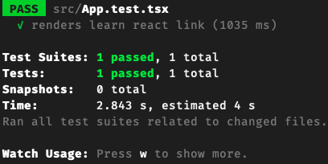

# Install
First, get the framework installed.
You will need a decent network and powerful machine to run it, and pickup a comfortable root folder (if you have local git server, you may want to use its root folder instead of the **github**). In this doc, I arbitrarily set the root folder as **~/repos**.
Replace the project name **bh4dcl** with your favored one.
```
cd ~/repos
npx create-react-app bh4dcl --template typescript
```

Pour yourself a cup of coffee and then return back when it's done.
Don't run the startup code, clean your repo first.

## clean up
```cd bh4dcl```
Before you can trully start up you project, you'd better clean up the defaults brought by the **npx** installer.
Here is a list of the files you are going to delete
| file               |
| :-----             |
| public/logo192.png |
| public/logo512.png |
| src/logo.svg       |

Then, modify these files so you can remove the dependencies of the above detelted files.
| file                 | modification                                                            |
| :--                  | :--                                                                     |
| README.md            | Dump its content and put what ever you want to say for your new project |
| public/index.html    | the <link> href to the "logo192.png"                                    |
|                      | the <title> content to your favored one.                                |
| public/manifest.json | the **short_name**                                                      |
|                      | the **name**                                                            |
|                      | remove the "logo192.png" and "logo512.png" part                         |
| src/App.js           | remove the imports of **React** and **logo**                            |
|                      | Dump the <header> element in the <div>, only keep the <div> it self.    |


Now, test see it's still working:
```npm t```
Lucky enough, you will the see a beautiful **green** result.


